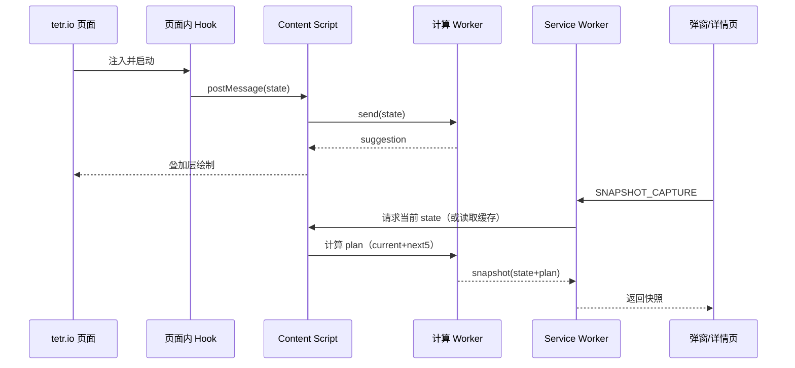

# 技术设计: TETR.IO 摆放建议叠加层（离线 AI）

## 技术方案

### 核心技术（不绑死 UI）
- Chrome 扩展（建议 MV3）
- 页面内注入 Hook（A 路线）拿到棋盘/当前块/Hold/Next5
- 计算放到 Worker（避免卡游戏）
- 引擎接口统一：先用占位引擎跑通，再接 cold-clear（WASM）
- UI 在本项目内实现；前端风格/结构参考 `ref/tetrismind/`

### 实现要点（按数据流讲）
1. **注入 Hook（页面上下文）**：在 tetr.io 页面里运行，直接读到游戏内部状态（或钩住关键函数拿到状态）
2. **桥接（content script）**：把 Hook 的状态转成扩展可用的数据，并转发给 Worker 算建议
3. **引擎（worker + wasm/js）**：输入 GameState，输出 Suggestion（当前块落点）和 Plan（详情页完整摆法）
4. **叠加层绘制**：拿 Suggestion.cells 直接画轮廓/阴影
5. **快照存储（service worker）**：打开详情页时，把当下 state + suggestion 存起来，支持回看

---

## 架构设计

---

## 架构决策 ADR

### ADR-001: 状态提取选 A（页面内注入 Hook）
**上下文:** 我们要的是“实时棋盘/当前块/Hold/Next5”，并且要“装上就能用”。  
**决策:** 走 A：注入 Hook，从页面内部拿状态。  
**理由:** 最接近真实数据，不卡画质/分辨率/皮肤；也更适合离线。  
**替代方案:**  
- B（抓网络包）→ 拒绝原因：往往拿不到完整本地棋盘快照，需要自己还原状态，成本高  
- C（截图识别）→ 拒绝原因：太挑设置，鲁棒性差，用户体验差  
**影响:** tetr.io 更新可能导致 Hook 失效，需要做“探测 + 兜底 + 快速修复”

### ADR-002: 引擎优先离线（WASM）
**上下文:** 你希望装上插件就能用，不起本机服务。  
**决策:** 引擎优先走 WASM（例如 cold-clear 编译到 wasm），在 Worker 里跑。  
**替代方案:** 本机 localhost 服务 → 拒绝原因：安装门槛高，违背“装上即用”。  
**影响:** 需要处理 wasm 体积、初始化速度、线程（WebAssembly threads）能力差异

### ADR-003: Next5 + 7-bag 推断用“采样”做增强
**上下文:** 只看 next5 不够，但也不可能真的知道更远的顺序。  
**决策:** 基于 7-bag 规则，生成多条“可能的后续序列”，跑多次引擎取期望或取最稳。  
**影响:** 计算量会上升，需要限制采样次数与深度

### ADR-004: 详情页只显示“打开那一刻的快照”
**上下文:** 你希望玩家能回看当时的决策，而不是一直跳。  
**决策:** 打开详情页时保存快照并冻结；后续只浏览快照历史。  
**影响:** 需要做快照容量上限与清理策略

---

## API 设计（内部消息）
建议以 `type + payload` 的形式实现（详见 `helloagents/wiki/api.md`），重点是：
- 实时更新用 `STATE_UPDATE` / `SUGGESTION_UPDATE`
- 快照用 `SNAPSHOT_CAPTURE` / `SNAPSHOT_LIST` / `SNAPSHOT_GET`
- 设置用 `SETTINGS_GET` / `SETTINGS_SET`

---

## 数据模型
以 `helloagents/wiki/data.md` 为准；快照里至少要保存：
- `state`（棋盘/块序/模式）
- `suggestion`（当时建议）
- `settings`（当时用的预设）

---

## 安全与性能
- **安全:**
  - 不保存任何账号令牌
  - 默认谨慎：检测到疑似竞技匹配/排位时，建议自动禁用并提示风险
- **性能:**
  - Worker 里算，主线程只负责画
  - 节流：不要每毫秒都算；优先在“当前块变化/棋盘变化”时触发
  - 超时保护：一帧算不完就降级（例如减少深度/停止采样）

---

## 测试与部署（验收清单）
- **安装:** Chrome “加载已解压扩展程序” 能正常装上
- **40L:** 进入 40L，叠加层能显示当前块建议；不卡
- **对战:** 进入对战（非竞技匹配时），叠加层能显示建议
- **详情页快照:** 打开扩展详情页会生成快照；关闭再打开会多一条；不实时跳动
- **快照回看:** 上一条/下一条切换正常，对应建议也一致
- **离线:** 断网情况下仍能显示建议（不依赖外部接口）
