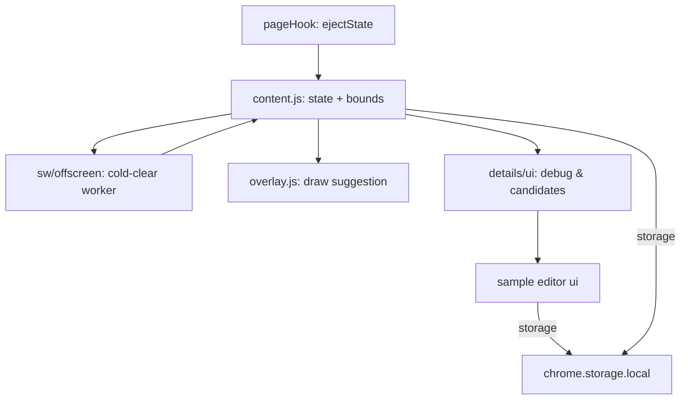

# 技术设计: 对战“更像最优解” + 采样点管理与校准预览

## 技术方案

### 核心技术
- 仍使用现有链路：`pageHook(ejectState)` → `content.js` → `sw/offscreen` → `coldClearTbpClient` → 回传落点
- 采样点/校准数据存储：`chrome.storage.local`（通过 `extension/shared/settings.js` 的 `tbpSettings.setSettings()`）

### 实现要点（大白话）

#### 1) “为啥我们不是选最优解？”
现在 cold-clear 会返回一堆候选落点（可以理解成“它觉得从好到坏的清单”）。
- **最简单的“最优”**就是：永远取第 1 名（它自己认为最优）。
- 但我们之前为了让你感觉更像对战，会在前面几名里“优先挑 T-Spin”，这就不再是严格第 1 名了。

所以这次要做的是：把“选法”变成一个明确的策略，让你能选，也能看得懂。

#### 2) 对战上下文（combo / B2B）为什么重要？
对战的收益不是只看“消几行”，还看：
- 连击（combo）会加伤害
- B2B（连续的 T-Spin / Tetris）也会加伤害

TBP 的 `start` 消息本身就支持 `combo` 和 `back_to_back`。我们现在一直写死 `combo=0`、`back_to_back=false`，所以 cold-clear 其实“并不知道你此刻是不是 B2B/连击中”，自然更像在做“通用摆法”而不是“冲伤害”。

计划：从 `ejectState()` 里尽量提取这些字段，并填进 `start`。

#### 3) tetr.io 伤害规则从哪里来？
先用公开资料作为“参考实现”，并在代码里注明来源：
- tetris.wiki 上的 TETR.IO 页面（包含伤害/连击/B2B 相关描述）
- 其他社区整理表（作为对照，避免单一来源误差）

> 说明：tetr.io 规则可能会改，所以“按伤害估算重排”会做成可选实验，不强制默认开启。

#### 4) 采样点自适应逻辑（我们现在是怎么做的）
当窗口大小变化时，我们会：
1) 找出 `scaleSamples` 里**窗口大小最接近**的几条样本
2) 做一次“去离群”（避免极小窗口那种误差样本把结果拉歪）
3) 用距离加权平均得到一个更稳的 `boundsAdjust`
4) 用它去重算 `boundsLockedRect`，让叠加层尽量继续贴住棋盘

#### 5) “保存校准”保存到哪里？
保存到 Chrome 扩展自己的本地存储：`chrome.storage.local`（也就是你浏览器本机、这个用户配置里）。
关键字段：
- `boundsLockedRect`：你最后保存的像素框
- `boundsAdjust`：相对比例（用于自适应）
- `scaleSamples`：采样点列表（用于自适应建模）

#### 6) 采样点管理与校准预览
- 新增一个“采样点管理页”：能删/禁用/导入导出 `scaleSamples`
- 校准模式拖动框实时预览：利用 overlay 已有的 `onUpdate` 回调，拖动时实时 `setBounds + drawSuggestion`
- “保存校准”与“保存为样本”分开：避免用户随手校准就把坏样本写进模型里

#### 7) tetr.io 允许“上边界之外”的格子：叠加也要能显示
现在我们会把 `y < 0`（相对可见 20 行而言）的格子直接不画，所以当你堆得很高时，提示会“少一截”。

计划：
- 绘制层不再裁掉上方格子：把叠加画布向上扩出一段（按 `bufferRows` 计算），让提示能画到棋盘上方的缓冲区。
- 校验逻辑也别把 `y < 0` 当成“非法”：上方缓冲区默认当作空的（只要 x 还在 0..9 就行）。

#### 8) 快捷键（默认 E）一键开/关提示
- 在 content script 监听 `keydown`：按 `E` 切换“是否显示提示”。
- 为了不影响正常打字：当焦点在 `input/textarea` 或 `contenteditable` 元素里时不触发。
- 作为设置项：默认 `E`，可以改，也可以完全关闭快捷键。

#### 9) “读取更长块序”开启/关闭要两套记忆系统
我们现在为了应对 Zen 的 undo，会对“同一个局面”做缓存/复用（你叫它“记忆”）。
但如果用户在某一步把 `读取更长块序（更强但更像作弊）` 从开 → 关（或反过来），就不该继续沿用另一边的记忆结果，否则很容易出现：
- 悬浮提示和详情页不一致
- undo/hold 后同局面建议“看起来乱跳”

计划：把缓存分成两套（读长序列一套 / 只看 next5 一套），互不影响。

## 架构设计

## 安全与性能
- **性能:** 候选重排（若做“按伤害估算”）只在候选前 N 条做（比如 30 条），并缓存同局面结果，避免卡顿。
- **合规/公平:** 默认仍是“提示”而非自动操作；并把“伤害估算重排”做成可选项（默认关闭），减少被滥用风险。

## 测试与部署
- **手动验证清单:**
  - 对战/40L 切换策略后，详情页显示策略与候选排行
  - 校准模式拖动时叠加实时预览
  - “保存校准”不会新增样本；“保存为样本”才会新增
  - 采样点管理页：删/禁用后，自适应行为立刻变化
  - 堆高时（格子超过上边界）提示依然能完整显示
  - 按 `E` 能立即开/关提示（在聊天输入框打字不触发）
  - 开/关“读取更长块序”后，undo/hold 的建议不会互相串台

## 参考资料（联网搜索结果）
- TETR.IO 伤害/连击/B2B 规则（社区整理，较完整）：`https://tetris.wiki/TETR.IO`
- 伤害表对照（可用于交叉验证）：`https://tetris.johnbeak.cz/`
- Cold Clear v1（历史仓库/已归档）：`https://github.com/MinusKelvin/cold-clear`
- Cold Clear v2（升级版/仍在维护）：`https://github.com/MinusKelvin/cold-clear-2`
