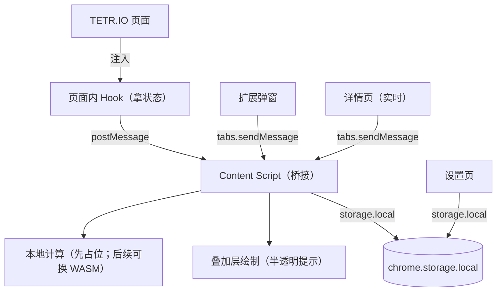

# 架构设计

## 总体架构

## 技术栈（不把你绑死）
- **Chrome 扩展:** 建议 Manifest V3
- **状态提取:** 页面内注入脚本（A 路线），尽量少依赖画面识别
- **计算引擎:** 先用轻量占位引擎跑通，再接 cold-clear（WASM）做强力解
- **UI:** 本项目实现（参考 `ref/tetrismind/` 的前端风格与结构）

## 核心流程（用人话讲）
1. 用户打开 tetr.io，扩展把一个“Hook”塞进页面里。
2. Hook 能拿到棋盘、当前块、Hold、Next（至少 5 个）。
3. 我们把这些状态丢给本地引擎算“当前块建议怎么放”。
4. 内容脚本在棋盘上方画一个半透明提示。
5. 用户点“打开详情（实时）”时，会打开一个详情页：实时展示「当前块 + Next5」的推荐步骤，方便你边玩边对照。

> 备注：快照/回看这类功能先搁置（后面你需要再加回来）。

## 重大架构决策

| adr_id | title | date | status | affected_modules | details |
|--------|-------|------|--------|------------------|---------|
| ADR-001 | 选用 A：页面内取状态（注入 Hook） | 2026-02-09 | ✅已采纳 | state | 见方案包 how.md |
| ADR-002 | 引擎离线化：WASM 优先（cold-clear） | 2026-02-09 | ✅已采纳 | engine | 见方案包 how.md |
